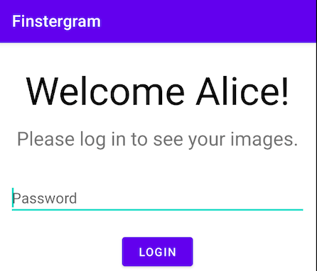

    <h2>Finstergram - an Intentionally Vulnerable Android App</h2>
  

Finstergram is an Android app with intentionally built-in security vulnerabilities.
It can be used to learn and teach about common security issues of Android applications.

## Setup

Simply open and build the project in your favorite version of Android Studio.

## What the App Does

Finstergram ("finster" ~= dark in German) is like Instagram, except only you have access to your
images. The app always asks for your password before it opens your secret gallery, which means
not even other users of the phone can get access to them (or can they?).

## The Challenge

You have access to a (non-rooted) phone with an installation of Finstergram, but while you can
unlock the phone, you do not have the password to unlock the app. Can you find vulnerabilities in
Finstergram's code which allow you to get access to the secret gallery?
Hint: using adb and installing new apps is allowed.

  

## Some Starting Points

- Check the AndroidManifest
- How is the password validated?
- Check the broadcast mechanisms
- Is there a way to leverage intents?

## Finstergram's Vulnerabilities

A description of the vulnerabilities and how they could be exploited (Spoiler Alert!) can be found [here](docs/Solutions.md).

## Contributors:

* [Jonas Mayer](https://www.linkedin.com/in/jonas-mayer-aa9bba200/)
* [Florentin Wieser](https://www.linkedin.com/in/fwieser/)